# Logseq Finance Brain - Architecture v0

## Overview

A minimal Logseq plugin for personal finance management that leverages the local graph as a database. The plugin focuses on tracking liquid cash, cash flow, burn rate, investments, and net worth using monthly statements.

## Architecture Diagram

```mermaid
graph TB
    subgraph "Logseq Graph Database"
        A[Finance Pages]
        A --> B[Monthly Statement Pages]
        A --> C[Account Pages]
        A --> D[Dashboard Page]
        A --> N[Investment Pages]

        B --> E[Statement Blocks with Properties]
        C --> F[Account Blocks with Properties]
        N --> O[Investment Account Blocks]
        N --> P[Holdings Blocks]

        E --> G[expense:: amount]
        E --> H[category:: type]
        E --> I[date:: YYYY-MM-DD]
        E --> J[merchant:: name]

        F --> K[balance:: amount]
        F --> L[account-type:: checking/savings/credit/loan]
        F --> M[institution:: name]
        F --> LN[loan-type:: student/auto/mortgage/personal]
        F --> IR[interest-rate:: percentage]
        F --> MP[minimum-payment:: amount]

        O --> Q[account-type:: investment]
        O --> R[total-value:: amount]
        O --> S[vested-value:: amount]

        P --> T[symbol:: ticker]
        P --> U[shares:: quantity]
        P --> V[value:: amount]
    end

    subgraph "Plugin Components"
        W[Main Plugin Entry]
        W --> X[Statement Importer]
        W --> Y[Dashboard Generator]
        W --> Z[Query Engine]
        W --> AA[UI Components]

        X --> AB[CSV Parser]
        X --> AC[Block Creator]
        X --> AD[Investment Statement Parser]

        Y --> AE[Cash Flow Calculator]
        Y --> AF[Burn Rate Calculator]
        Y --> AG[Liquid Cash Aggregator]
        Y --> AH[Net Worth Calculator]
        Y --> AI[Asset Allocation Analyzer]
        Y --> DM[Debt Management Calculator]

        Z --> AJ[Datalog Queries]
        Z --> AK[Block Aggregations]
    end

    subgraph "User Interface"
        AL[Toolbar Button]
        AM[Dashboard View]
        AN[Import Modal]
        AO[Finance Summary Widget]
        AP[Net Worth Widget]
        DW[Debt Management Widget]
    end

    W -.-> A
    Z -.-> E
    Z -.-> F
    Z -.-> O
    Z -.-> P
    Y -.-> D
    X -.-> B

    AL --> AN
    AL --> AM
    AM --> AO
    AM --> AP
    AM --> DW
```



## Data Structure

### 1. Page Hierarchy

```
Finance/
├── Dashboard
├── Accounts/
│   ├── Capital One Platinum CC
│   ├── Capital One Savings
│   ├── Bank of America Checking
│   ├── Student Loan - Federal Direct
│   ├── Auto Loan - Toyota Financial
│   └── Personal Loan - SoFi
├── Investments/
│   └── Robinhood Roth IRA/
│       ├── Overview
│       └── Holdings
└── Statements/
    ├── 2025-01/
    │   ├── Capital One Platinum
    │   └── Robinhood Roth IRA
    └── 2025-02/
        ├── Capital One Platinum
        └── Robinhood Roth IRA
```

### 2. Block Properties Schema

#### Account Block

```clojure
type:: account
account-name:: "Capital One Platinum CC"
account-type:: credit-card
credit-limit:: 3500
current-balance:: 2100.50
last-updated:: 2025-01-15
institution:: "Capital One"
```

#### Loan Account Block

```clojure
type:: account
account-name:: "Federal Direct Subsidized"
account-type:: loan
loan-type:: student
balance:: 25000
interest-rate:: 4.99
minimum-payment:: 250
original-amount:: 30000
last-updated:: 2025-01-15
institution:: "US Department of Education"
```

#### Investment Account Block

```clojure
type:: investment-account
account-name:: "Robinhood Roth IRA"
account-type:: retirement
total-value:: 17980.28
cash-balance:: 500.00
invested-value:: 17480.28
last-updated:: 2025-01-15
institution:: "Robinhood"
```

#### Investment Holding Block

```clojure
type:: holding
account:: [[Finance/Investments/Robinhood Roth IRA]]
symbol:: "VTI"
name:: "Vanguard Total Stock Market ETF"
shares:: 45.5
current-price:: 240.50
current-value:: 10942.75
cost-basis:: 9500.00
gain-loss:: 1442.75
percentage:: 60.9  ; % of portfolio
```

#### Statement Entry Block

```clojure
type:: expense
date:: 2025-01-15
amount:: 45.99
merchant:: "Amazon"
category:: "Shopping"
account:: [[Finance/Accounts/Capital One Platinum CC]]
statement-month:: 2025-01
```

#### Income Block

```clojure
type:: income
date:: 2025-01-01
amount:: 8182.89
source:: "Ethos"
account:: [[Finance/Accounts/Capital One Savings]]
net-amount:: 8182.89  ; after conversion fees
```

### 3. Dashboard Queries

The dashboard will use Datalog queries to calculate:

- **Liquid Cash**: Sum of all checking/savings account balances
- **Total Investments**: Sum of all investment account values
- **Net Worth**: Assets (liquid + investments) - Liabilities (credit cards + loans)
- **Cash Flow**: Income - Expenses for a given period
- **Burn Rate**: Average monthly expenses
- **Available Credit**: Credit limits - Current balances
- **Total Debt**: Credit card balances + Loan balances
- **Debt-to-Income Ratio**: Monthly debt payments / Monthly income
- **Asset Allocation**: Breakdown of investment holdings

## Plugin Components

### 1. Statement Importer

- Parse CSV exports from Capital One and Robinhood
- Create structured blocks with proper properties
- Handle duplicate detection
- Support manual entry fallback
- Parse investment transactions (buy/sell/dividend)

### 2. Dashboard Generator

- Real-time calculations using queries
- Monthly/Quarterly/Yearly views
- Net worth tracking over time (includes all assets and liabilities)
- Investment performance metrics
- Asset allocation visualization
- Debt management insights
- Export capabilities

### 3. Query Engine

- Pre-built Datalog queries for common calculations
- Investment-specific queries (gains, allocation, etc.)
- Custom query builder for advanced users
- Query result caching for performance

### 4. UI Components

- Minimal, clean interface
- Net worth summary widget
- Investment portfolio view
- Asset allocation breakdown
- Keyboard shortcuts for quick access
- Quick actions (update balances, record transactions)

## Technical Stack

- TypeScript
- Logseq Plugin API
- No external dependencies (keeping it minimal)
- Local storage only
